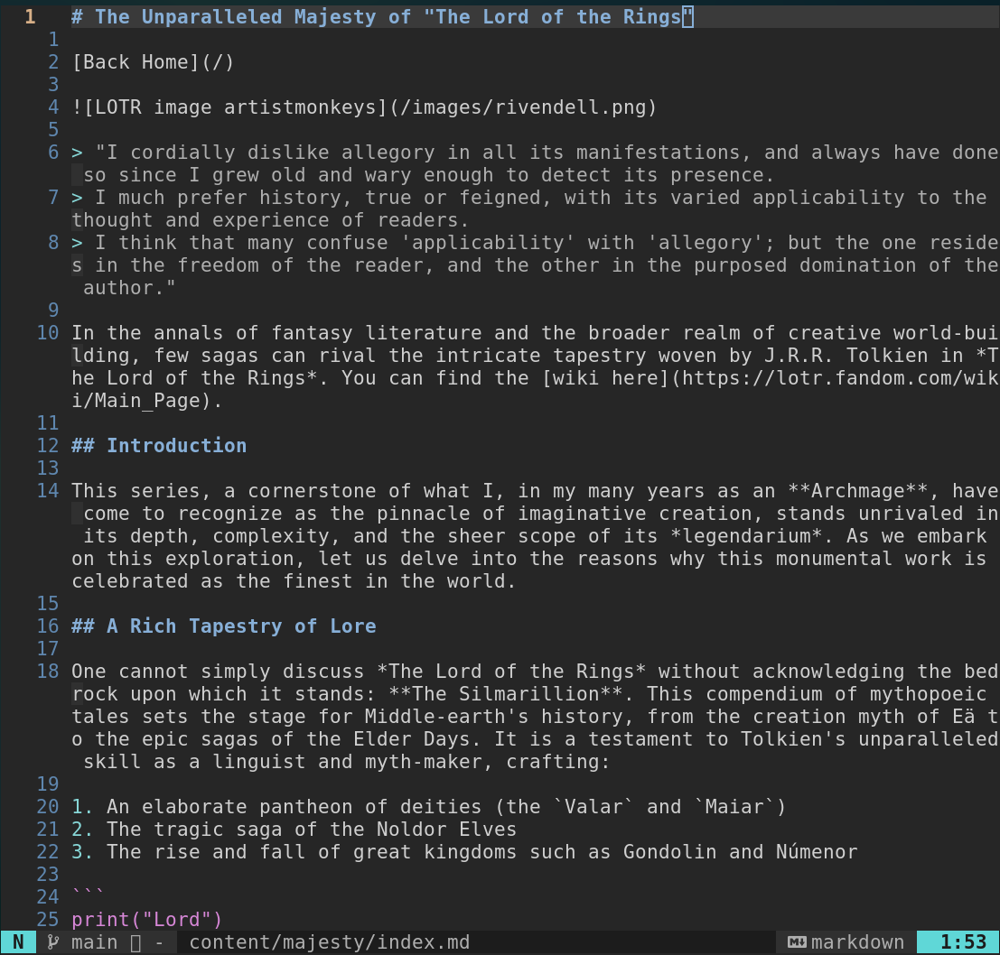

# Static Site Generator

Generates static site from markdown files.

Example:

## Usage instructions:
1. Clone and cd to repo
2. Place markdown files for the webpage in content/
3. Place any static files such as css, images etc. in static/
4. run `./main.sh`
5. Visit localhost/8888 to see the newly generated site

## Boot.dev project

This project was completed as part of the [boot.dev](https://www.boot.dev) course curriculum. Do check them out!
